# Architecture Overview

## System Architecture Diagram

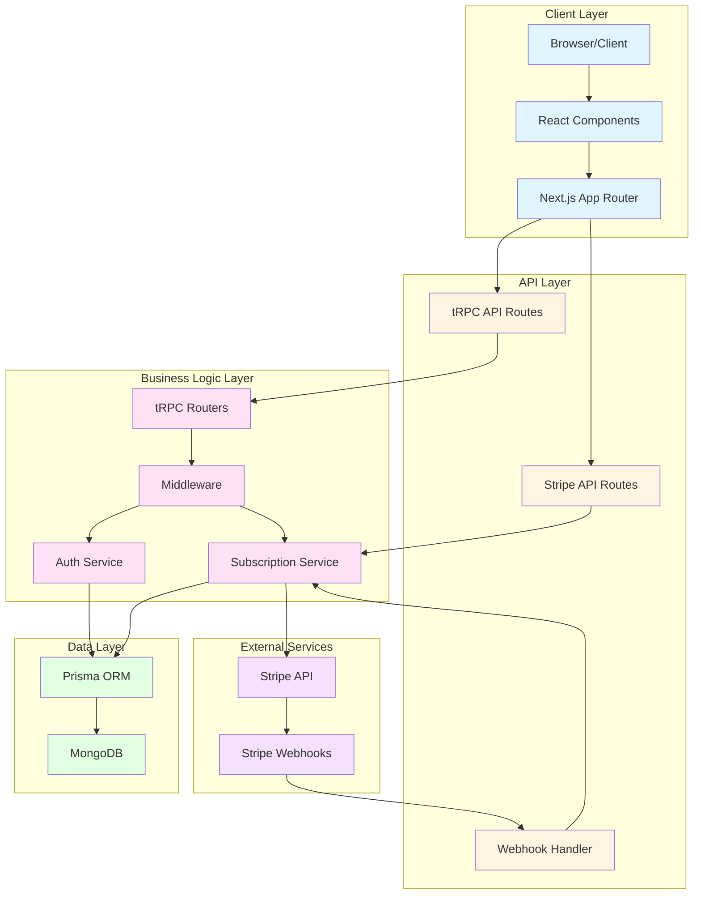

## Project Structure

```
trpc-saa-s-starter/
├── src/                          # Source code directory
│   ├── app/                      # Next.js App Router
│   │   ├── api/
│   │   │   ├── trpc/[trpc]/      # tRPC API route handler
│   │   │   │   └── route.ts      # Next.js API route
│   │   │   └── stripe/           # Stripe API routes
│   │   │       ├── checkout/     # Checkout session creation
│   │   │       └── webhook/      # Webhook handler
│   │   ├── dashboard/            # Dashboard pages
│   │   │   ├── users/            # Admin user management
│   │   │   ├── audit-logs/       # Audit logs (all users)
│   │   │   ├── api/              # API key management
│   │   │   ├── projects/         # Project management
│   │   │   ├── organizations/   # Organization management
│   │   │   ├── billing/          # Subscription & billing
│   │   │   └── settings/         # User settings
│   │   ├── register/             # User registration page
│   │   ├── layout.tsx            # Root layout
│   │   ├── page.tsx              # Landing page
│   │   └── globals.css           # Global styles
│   │
│   ├── components/               # React components
│   │   ├── api/                  # API feature components
│   │   ├── auth/                 # Authentication forms
│   │   ├── dashboard/            # Dashboard components
│   │   ├── users/                # User management components
│   │   ├── audit-logs/           # Audit log components
│   │   ├── projects/             # Project components
│   │   ├── ui/                   # Reusable UI components (shadcn/ui)
│   │   └── theme-provider.tsx    # Theme context provider
│   │
│   ├── lib/                      # Shared utilities
│   │   ├── server/               # Server-side code
│   │   │   ├── routers/          # tRPC routers
│   │   │   │   ├── auth.ts
│   │   │   │   ├── users.ts
│   │   │   │   ├── organizations.ts
│   │   │   │   ├── projects.ts
│   │   │   │   ├── subscriptions.ts
│   │   │   │   ├── audit-logs.ts
│   │   │   │   ├── api-keys.ts
│   │   │   │   ├── health.ts
│   │   │   │   ├── subscriptions-realtime.ts
│   │   │   │   └── index.ts
│   │   │   ├── auth/             # JWT & password utilities
│   │   │   │   ├── jwt.ts
│   │   │   │   └── password.ts
│   │   │   ├── middleware/       # tRPC middleware
│   │   │   │   ├── audit.ts
│   │   │   │   └── rate-limit.ts
│   │   │   ├── utils/            # Server utilities
│   │   │   │   ├── stripe-dates.ts  # Stripe date handling
│   │   │   │   └── errors.ts
│   │   │   ├── realtime/         # Real-time events
│   │   │   │   └── events.ts
│   │   │   ├── stripe.ts         # Stripe client configuration
│   │   │   ├── db.ts             # Prisma singleton
│   │   │   ├── trpc.ts           # tRPC setup & procedures
│   │   │   └── types.ts          # Server types
│   │   ├── queries/              # tRPC query hooks
│   │   │   └── subscriptions.queries.ts
│   │   ├── trpc-client.ts        # Client-side tRPC utilities
│   │   └── utils.ts              # Shared utilities
│   │
│   ├── hooks/                    # Custom React hooks
│   │   ├── use-auth.ts           # Authentication hook
│   │   ├── use-mobile.ts         # Mobile detection hook
│   │   ├── use-organization.ts   # Organization context hook
│   │   ├── use-subscription.ts   # Subscription hook
│   │   └── use-toast.ts          # Toast notification hook
│   │
│   └── types/                    # TypeScript types
│       └── auth.ts               # Authentication types
│
├── prisma/                       # Database schema
│   └── schema.prisma             # Prisma schema (MongoDB)
│
└── public/                        # Static assets
```

## Architecture Layers

### 1. Presentation Layer (Next.js App Router)

- **Next.js 16** - React framework with App Router
- **Server Components** - Default rendering strategy
- **Client Components** - Interactive UI with "use client"
- **API Routes** - tRPC endpoint at `/api/trpc/[trpc]`
- **Server Actions** - Server-side mutations (via tRPC)

### 2. API Layer (tRPC)

- **tRPC Routers** - Type-safe API endpoints
- **Procedure Types** - `query`, `mutation`, `subscription`
- **Input Validation** - Zod schemas for all inputs
- **Type Safety** - End-to-end TypeScript types
- **Error Handling** - Structured error responses

### 3. Business Logic Layer

- **Service Functions** - Complex business operations
- **Cross-cutting Concerns** - Audit logging, rate limiting
- **Event Emission** - Real-time updates via EventEmitter
- **Authorization** - Role-based and resource-level checks

### 4. Data Access Layer

- **Prisma ORM** - Type-safe database client
- **MongoDB** - NoSQL database with flexible schema
- **Database Models** - User, Organization, Project, AuditLog, etc.
- **Query Optimization** - Indexes and efficient queries

### 5. Authentication & Authorization

- **JWT Tokens** - Stateless authentication
- **Session Tracking** - Database-backed sessions
- **Context-based Auth** - User context in tRPC procedures
- **Role-Based Access Control** - USER/ADMIN roles
- **Organization Permissions** - OWNER/ADMIN/MEMBER roles

## Data Flow

### Query Flow Diagram

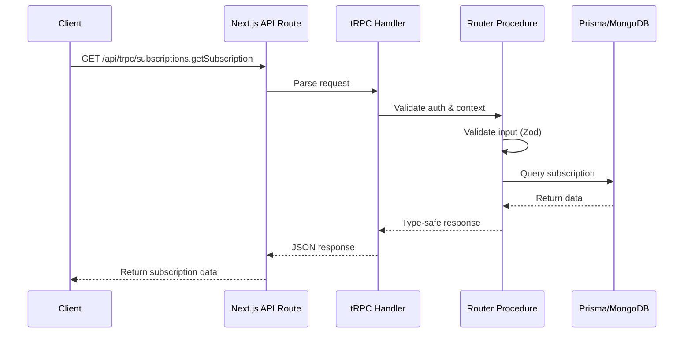

### Query Flow (Next.js + tRPC)

```
Client Component (React)
↓
useQuery Hook / trpcQuery()
↓
Next.js API Route (/api/trpc/[trpc])
↓
tRPC Handler (route.ts)
↓
tRPC Procedure (authentication, context)
↓
Router Procedure (input validation with Zod)
↓
Business Logic (database queries, authorization)
↓
Prisma ORM (MongoDB interaction)
↓
Response to Client (type-safe)
```

### Mutation Flow Diagram

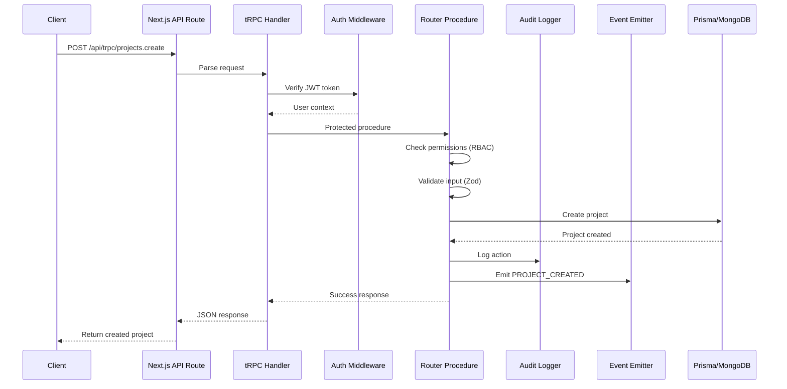

### Mutation Flow

```
Client Component (React)
↓
useMutation Hook / trpcMutation()
↓
Next.js API Route (/api/trpc/[trpc])
↓
tRPC Protected Procedure
↓
Permission Check (RBAC + Organization)
↓
Input Validation (Zod schema)
↓
Business Logic Execution
↓
Emit Real-time Event (EventEmitter)
↓
Create Audit Log
↓
Database Transaction (Prisma)
↓
Response to Client
```

### Server Component Flow

```
Next.js Server Component
↓
Direct tRPC Call (server-side)
↓
tRPC Procedure
↓
Database Query
↓
Render HTML (SSR)
```

### Payment Flow Diagram (Stripe Integration)

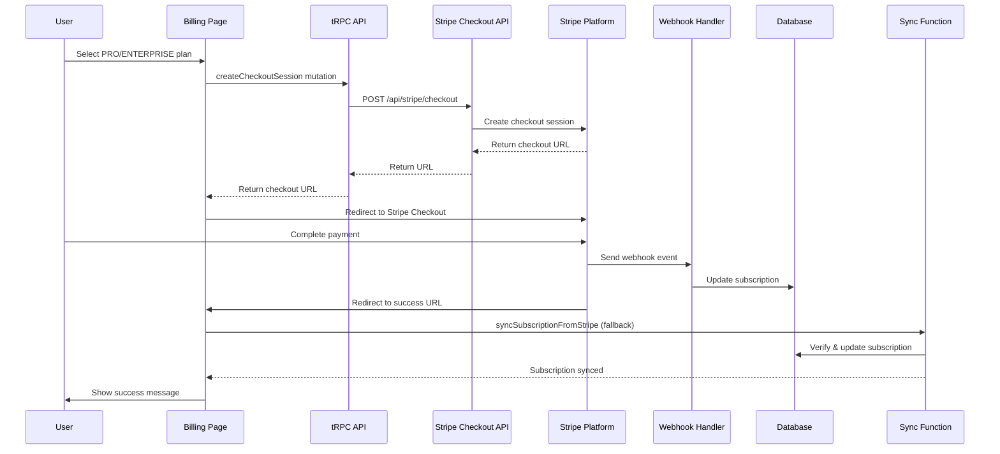

### Payment Flow (Stripe Integration)

```
User selects paid plan (PRO/ENTERPRISE)
↓
Billing Page (Client Component)
↓
createCheckoutSession mutation
↓
POST /api/stripe/checkout
↓
Stripe Checkout Session Created
↓
User redirected to Stripe Checkout
↓
Payment completed on Stripe
↓
Stripe Webhook → POST /api/stripe/webhook
↓
Subscription updated in database
↓
Fallback: syncSubscriptionFromStripe (if webhook fails)
↓
User redirected to /dashboard/billing?success=true
↓
Subscription synced and UI updated
```

## Security Architecture

### Security Layers Diagram

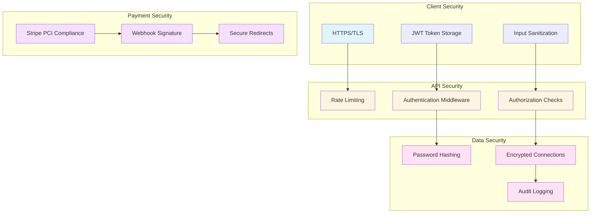

### Authentication

- **JWT Tokens** - 7-day expiration, stored in HTTP-only cookies (recommended) or localStorage
- **Password Hashing** - bcryptjs with 10 salt rounds
- **Session Management** - Database-backed sessions with expiration
- **API Keys** - Alternative authentication for PRO/ENTERPRISE plans
- **Stripe Webhooks** - Signature verification for secure webhook processing

### Authorization

- **Role-Based Access Control** - USER, ADMIN roles
- **Organization-Level Permissions** - OWNER, ADMIN, MEMBER roles
- **Resource-Level Access** - Organization-scoped data access
- **Procedure Protection** - `protectedProcedure`, `adminProcedure`

### Rate Limiting

- **Global Rate Limit** - 100 requests per 15 minutes
- **Auth Endpoints** - 5 requests per 15 minutes
- **Mutations** - 100 requests per minute
- **Queries** - 500 requests per minute
- **Middleware-based** - Applied at tRPC procedure level

### Data Protection

- **Audit Logging** - All mutations logged with user, action, changes
- **Soft Deletes** - Archive instead of delete (projects)
- **Input Validation** - Zod schemas on all endpoints
- **NoSQL Injection Prevention** - Prisma ORM protection
- **XSS Protection** - React's built-in escaping
- **CSRF Protection** - SameSite cookies (when using cookies)
- **Payment Security** - Stripe PCI-compliant payment processing
- **Webhook Security** - Stripe signature verification

## Scalability Considerations

### Database

- **MongoDB** - Flexible schema, horizontal scaling
- **Indexes** - On frequently queried fields (userId, organizationId, createdAt)
- **Connection Pooling** - Prisma connection management
- **Query Optimization** - Selective field fetching, pagination

### Caching

- **Next.js Caching** - Built-in request caching
- **Session Caching** - In-memory session validation
- **Real-time Events** - EventEmitter for in-process events
- **HTTP Caching** - Cache headers for static assets

### Performance

- **Pagination** - All list endpoints support skip/take
- **Lazy Loading** - Relationships loaded on demand
- **Server Components** - Reduced client bundle size
- **Code Splitting** - Next.js automatic code splitting
- **Static Generation** - ISR for public pages (if applicable)

## Multi-Tenancy Design

### Multi-Tenancy Architecture Diagram

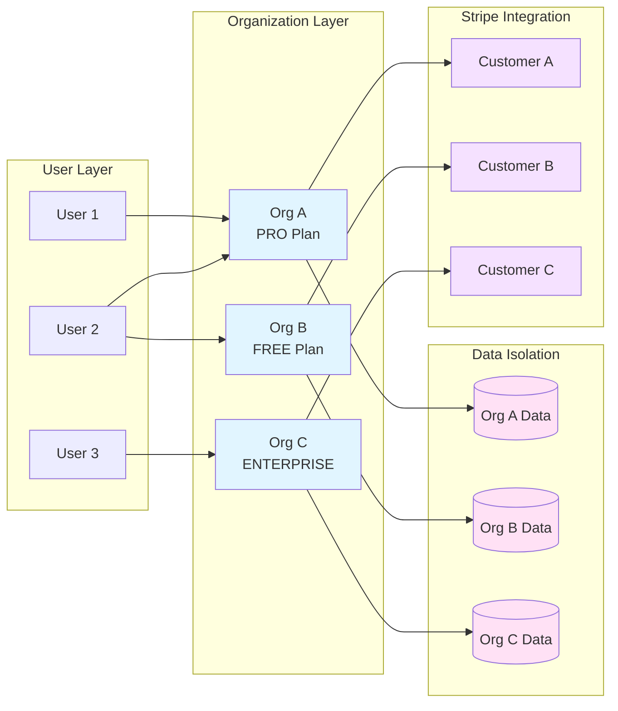

### Multi-Tenancy Features

- **Organization as Tenant** - Primary tenant boundary
- **Row-Level Security** - All queries filtered by organizationId
- **Subscription-Based Access** - FREE, PRO, ENTERPRISE plans
- **Resource Limits** - Plan-based limits (projects, API access)
- **Isolation** - Complete data isolation between organizations
- **Stripe Customer Mapping** - Each organization has Stripe customer ID
- **Subscription Management** - Stripe subscription IDs linked to organizations

## Real-time Architecture

### Real-time Event Flow Diagram

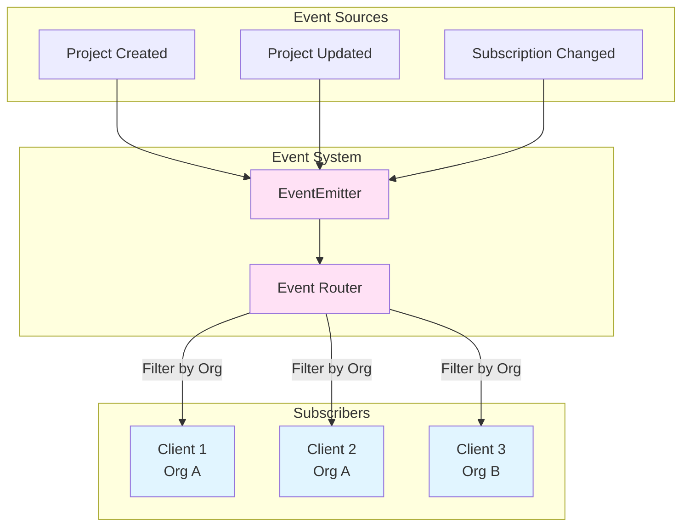

### Real-time Features

- **EventEmitter** - In-process event system
- **tRPC Subscriptions** - WebSocket-based subscriptions
- **Organization-Scoped** - Events filtered by organization
- **Automatic Cleanup** - Connection cleanup on disconnect
- **Event Types** - Project updates, organization changes

## Frontend Architecture

### Component Hierarchy Diagram

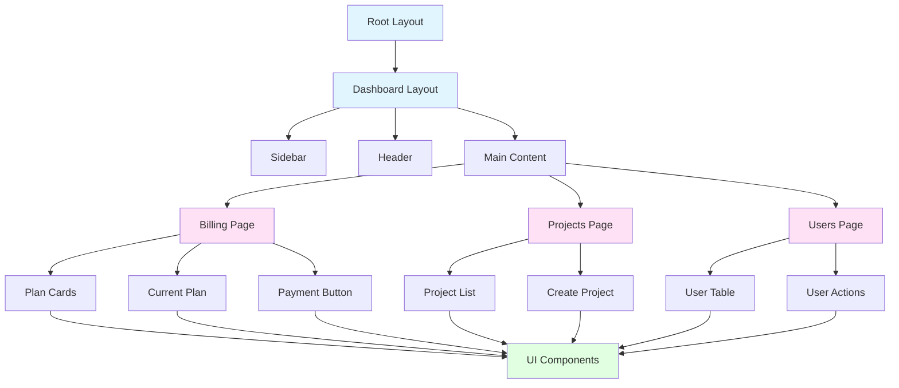

### Component Structure

- **Feature-Based** - Components organized by feature
- **UI Library** - Reusable shadcn/ui components
- **Client Components** - Interactive components with "use client"
- **Server Components** - Default for static content

### State Management

- **React Hooks** - Custom hooks for auth, organization, subscription
- **tRPC Hooks** - Type-safe data fetching
- **Context API** - Theme provider, auth context
- **Local State** - useState for component-level state

### Styling

- **Tailwind CSS v4** - Utility-first CSS framework
- **CSS Variables** - Theme customization
- **Dark Mode** - Built-in dark mode support
- **Responsive Design** - Mobile-first approach

## Deployment Architecture

### Production Build

- **Next.js Standalone** - Optimized production build
- **Docker Support** - Multi-stage Docker builds
- **Environment Variables** - Secure configuration
- **Health Checks** - `/api/trpc/health.check` endpoint

### Deployment Options

- **Vercel** - Recommended for Next.js
- **Render** - Docker-based deployment
- **Docker Compose** - Local development with MongoDB
- **Self-Hosted** - Docker container deployment

## Technology Stack

### Frontend

- **Next.js 16** - React framework
- **React 19** - UI library
- **TypeScript** - Type safety
- **Tailwind CSS v4** - Styling
- **Radix UI** - Accessible components
- **Lucide React** - Icons

### Backend

- **tRPC** - Type-safe API
- **Prisma** - ORM
- **MongoDB** - Database
- **JWT** - Authentication
- **bcryptjs** - Password hashing
- **Zod** - Schema validation
- **Stripe** - Payment processing and subscription management

### Development

- **TypeScript** - Type checking
- **ESLint** - Code linting
- **Vitest** - Testing framework (configured)

## API Design Principles

1. **Type Safety** - End-to-end TypeScript types
2. **Input Validation** - Zod schemas for all inputs
3. **Error Handling** - Structured error responses
4. **Pagination** - Consistent pagination across list endpoints
5. **Filtering** - Organization-scoped data access
6. **Audit Trail** - All mutations logged
7. **Rate Limiting** - Protection against abuse
8. **Documentation** - Complete API documentation
9. **Payment Integration** - Secure Stripe checkout and webhook handling
10. **Subscription Sync** - Automatic and manual subscription synchronization

## Stripe Integration Architecture

### Stripe Integration Flow Diagram

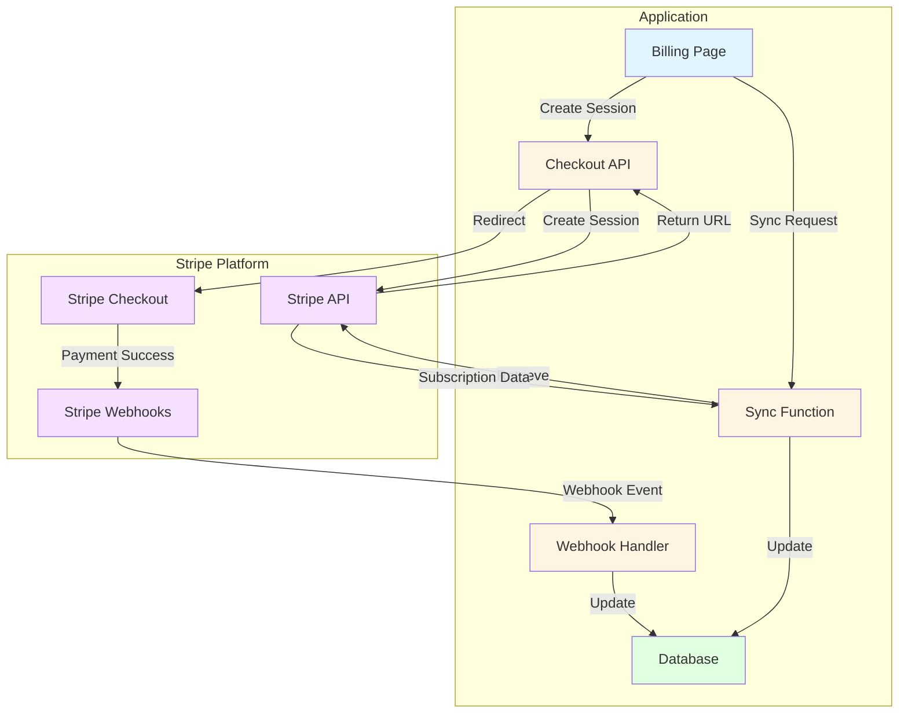

### Webhook Event Flow Diagram

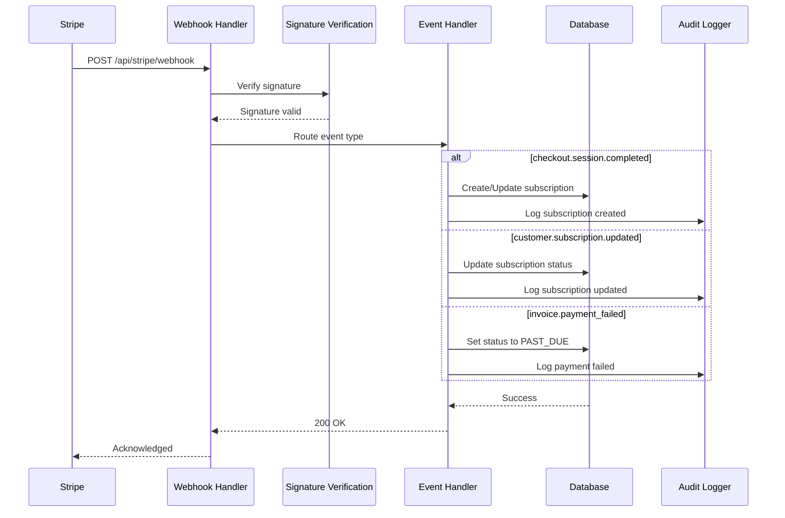

### Payment Processing

- **Checkout Sessions** - Stripe-hosted checkout for secure payment collection
- **Webhook Events** - Real-time subscription updates via webhooks
- **Fallback Sync** - Manual sync function for reliability
- **Customer Management** - Automatic Stripe customer creation
- **Subscription Tracking** - Stripe subscription IDs stored in database

### Webhook Handling

- **Event Types** - `checkout.session.completed`, `customer.subscription.*`, `invoice.*`
- **Signature Verification** - Webhook signature validation for security
- **Idempotency** - Safe to retry webhook events
- **Error Handling** - Graceful handling of missing or invalid data
- **Fallback Dates** - Default dates for incomplete subscriptions

### Subscription States

- **ACTIVE** - Active subscription with valid payment
- **PAST_DUE** - Payment failed, subscription past due
- **CANCELED** - Subscription canceled by user
- **EXPIRED** - Subscription expired or incomplete

### Subscription State Machine

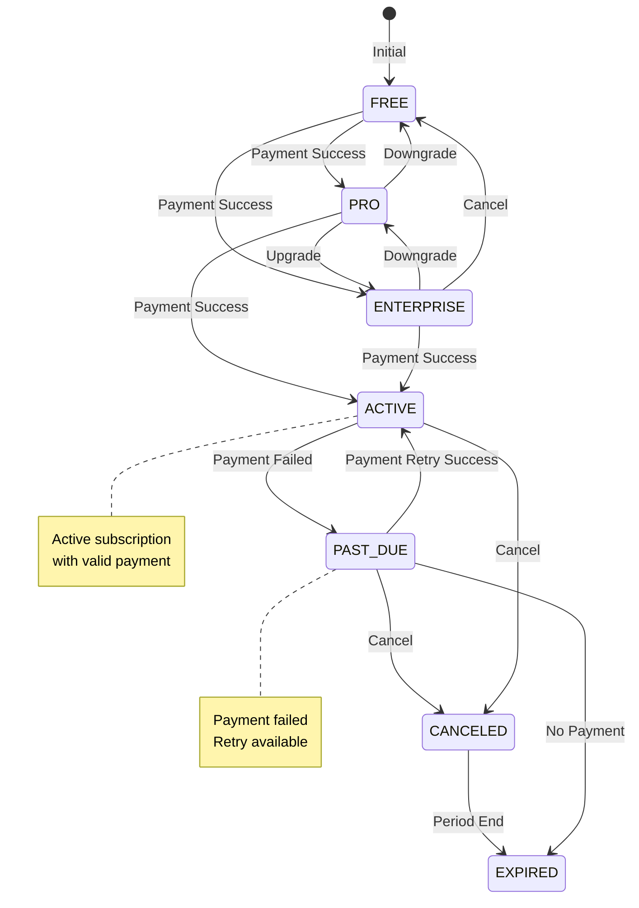
